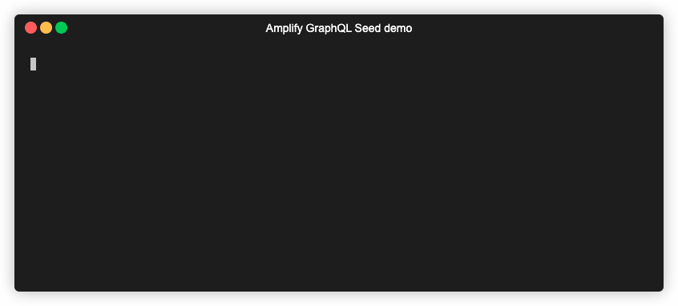

# Amplify GraphQL Seed plugin - BETA RELEASE
This is an [Amplify Plugin](https://docs.amplify.aws/cli/plugins/plugins/) which helps your to seed the databases of your Amplify projects with data using an AppSync GraphQL API. It can be used to seed local mock databases, as well as remote databases, e.g. for testing purposes. This plugin allows you to customize and auto-generate mock data, including data with relationships between models, beyond the capabilities of the 'Auto-generate data' functionality in Amplify Studio.

With this plugin, you can improve testing of your code 💯, reduce time by creating test data through automation ⏱️, and unify mock-data across your project by codifying it in your Version Control System 🚀. 

**Disclaimer**: this is a beta-release of the Amplify GraphQL Seed Plugin and may contain unforeseen bugs. This is a 3rd-party plugin and is not associated with the official Amplify project. Use this plugin at your own discretion. Please let us know if you encounter any bugs, or have feedback / suggestions. 



**Contents:**
  - [Installation 🛠️](#installation)
    - [Prerequisites](#prerequisites)
  - [Getting started  🔥🔥🔥](#getting-started--)
    - [Step 1. Run the init command from the root of your Amplify project:](#step-1-run-the-init-command-from-the-root-of-your-amplify-project)
    - [Step 2. Adjust the seed-data.js file to your needs](#step-2-adjust-the-seed-datajs-file-to-your-needs)
    - [Step 3. Run the plugin to seed your database](#step-3-run-the-plugin-to-seed-your-database)
  - [Available commands 🤖](#available-commands-)
  - [How does it work? 🤔](#how-does-it-work-)
    - [Customizing your seed-file](#customizing-your-seed-file)
    - [Authentication options](#authentication-options)
  - [Common errors ⛔](#common-errors-)
  - [How to use this plugin in CI/CD pipelines 🏗️](#how-to-use-this-plugin-in-cicd-pipelines)
  - [Uninstall the plugin 🗑️](#uninstall-the-plugin-️)
  - [About this project 💡](#about-this-project-)

## Installation 🛠️

### Prerequisites

To use this plugin with your Amplify CLI, you must have the following prerequisites setup: 
- amplify-cli @ 7.6.5^  - [available here](https://docs.amplify.aws/cli/start/install/)
- jq - [available here](https://stedolan.github.io/jq/download/)
- use Node versions @ 14.14.0 or above 
- Amplify project with a GraphQL API - [getting started with Amplify](https://docs.amplify.aws/start/getting-started/installation/q/integration/js/)

Once you have installed the above packages, you can install the GraphQL Seed plugin using the following commands: 
```bash
npm install -g amplify-graphql-seed-plugin
amplify plugin add amplify-graphql-seed-plugin
```

You can validate the installation by running: 
```amplify graphql-seed version```

The plugin will be available to use with your amplify-cli across all your projects.
## Getting started  🔥🔥🔥
We assume that by this stage you already have a GraphQL API configured in your project. If you don't, you can create one by running `amplify add api` and follow the prompts.
### Step 1. Run the init command from the root of your Amplify project: 
```sh
amplify graphql-seed init
```
### Step 2. Adjust the generated `seed-data.js` file to your needs
The init file has created the `amplify/backend/seeding/seed-data.js` file. Adjust mutations and data to run your custom seeding. See [this section](#customizing-your-seed-file) of the readme for more details.

### Step 3. Run the plugin to seed your database
**Option 1:** Start your mock database, and seed it:
```sh
amplify mock --seed
``` 

**Option 2:** Seed your database remotely after pushing

You can seed your database by running the command below in your terminal. 
```sh
amplify push --seed
``` 


**Option 3:** Run the plugin directly

You can seed your database by running the command below in your terminal. 
```sh
amplify graphql-seed run
``` 
or for remote databases in the AWS Cloud:

```sh
amplify graphql-seed run --remote
``` 

## Available commands 🤖
Below, you can find the available commands to interact with our plugin:
| Command &nbsp; &nbsp; &nbsp; &nbsp; &nbsp; &nbsp; &nbsp; &nbsp; &nbsp; &nbsp; &nbsp; &nbsp; &nbsp; &nbsp; &nbsp; &nbsp; &nbsp; &nbsp; &nbsp; &nbsp; &nbsp; &nbsp; &nbsp; &nbsp; &nbsp; &nbsp; &nbsp; &nbsp; &nbsp; &nbsp; &nbsp; &nbsp; &nbsp; &nbsp; &nbsp; &nbsp;| Flags &nbsp; &nbsp; &nbsp; &nbsp; &nbsp; &nbsp; &nbsp; &nbsp; &nbsp; &nbsp; &nbsp; &nbsp; | Description |
| ----------- | ----------- | ----------- |
| ```amplify graphql-seed init ``` | ```--remote```<br>```--local``` <br> ```--overwrite```| creates the files which you can customize to use our plugin |
| ```amplify mock --seed```   |  | Seeds the database after starting the mock database locally.|
| ```amplify mock --refresh```   |  | Deletes the local mock database, starts a new database, and subsequently seeds it.|
| ```amplify mock --delete```   |  | Deletes the local mock database, and starts a clean database locally.|
| ```amplify graphql-seed run``` | ```--remote``` <br> ```--username``` <br> ```--password``` | Runs the plugin to seed your database using GraphQL (either locally or remotely) |
| ```amplify graphql-seed help ``` | | Shows you information on how to use the plugin, including arguments |
| ```amplify graphql-seed version ``` | | Shows the current version of the plugin. |
| ```amplify graphql-seed remove ``` | | Allows you to remove the files created by this plugin. |

## How does it work? 🤔
Using the `init` command, the plugin will create a set of files for you which it uses for seeding your database which you can customize. In particular, it creates two new directories in your amplify folder called **backend/seeding** and **hooks** with the following files: 
```
.
├── ...
├── amplify                  
│   ├── backend          
│   │   ├── integration         
    │   ├── api
    │   ├── auth  
    │   ├── ... 
    │   ├── seeding                  
    │       ├── configurations.json # new
    │       ├── credentials.json    # new
    │       ├── customMutations.js  # new
    │       ├── seed-data.js        # new
    │       ├── .gitignore          # new
    │
    ├── hooks
        ├── post-mock.sh # new
        ├── post-push.sh # new
        ├── pre-mock.sh  # new
```
The files have the following contents: 
- `configurations.json` - holds the configuration of the plugin based on information the plugin found. You can override any values in this file.
- `seed-data.js` is the file which holds the actual seed data that will be added through GraphQL 
- \[Optional\] `credentials.json` - stores the credentials you can use to authenticate against your Cognito User Pool. It is important to only use this in your test environment, we don't recommend this for Production environments or security sensitive credentials. 
- \[Optional\] `customMutations.js` - in this file, you can specify additional custom mutations to use in your seed-data script.

The hooks files are used to run custom code before or after an Amplify command is run. Learn more about Command Hooks [here](https://docs.amplify.aws/cli/project/command-hooks/). Using the hooks files, you can automatically use our plugin when running `amplify mock` and `amplify push` with our custom `--seed` argument. 

- pre-mock.sh - custom code to run before running `amplify mock`, in this case, it will delete the local database if you instruct it to.
- post-mock.sh - custom code to automatically run our plugin to seed the database after running `amplify mock`
- post-push.sh - custom code to seed the database after finishing `amplify push`.

### Customizing your seed-file
Let's assume the following scenario, you have the following schema.graphql in your Amplify project
```graphql
type Todo @model @auth(rules: [
    {allow: owner, identityClaim: "email"}, 
    {allow: private, provider: userPools, operations: [read]},
    {allow: public, provider: apiKey, operations: [read, create]},
    {allow: private, provider: iam}
  ]) {
  id: ID!
  name: String!
  description: String
}
```
**Note: the above example allows all different authentication types supported by this plugin. Your case might differ. Take a look at this [section](#authentication-options) **

When you created the file with the `init` command, it automatically added some sample code to `amplify/backend/seeding/seed-data.js`. If you have auto-generated mutations in your project (from Amplify codegen), they will be imported at the top of the file. To create seed data, you'll add entries to the seed-data.js file in the following format (an example is automatically added): 
```javascript
import * as mutations from "../../../src/graphql/mutations.js"
import * as customMutations from "./customMutations.js"

export const createTodo = {
    mutation: mutations.createTodo,
    //override_auth: "API_KEY", // One of ["AWS_IAM", "API_KEY", "AMAZON_COGNITO_USER_POOLS"]
    data:  [
        { id: 1, name: "some", description: "Lorem ipsum stuff" },
        { id: 2, name: "nothing", description: "Lorem ipsum stuff" }
    ]
};
```
By default, the query will use your default authentication method specified in `aws-exports.js`, which you can verify in the generated `configuration.json` file as well. Within `seed-data.js`, you can override the authentication which should be used for individual mutations by using the `override_auth` attribute.

### Authentication options

Our Amplify GraphQL seeding plugin supports 3 different authentication modes. Each of them requires changes to be performed via amplify cli command if not setup already. 

1. Cognito User Pools 
  - To use this AuthN method, you need to create a test user in Cognito User Pools first. You can then use the following command to confirm the users credentials to be used later on. Note: you must run the command with the appropriate permissions in place. 
```shell
aws cognito-idp admin-set-user-password --user-pool-id <your_user_pool_id> --username <your_user_id> --password <your_password> --permanent
``` 
   - Make sure that Cognito User Pools is enabled as Authorization (AuthZ) option for your GraphQL API. You can do that by running `amplify api update`. Remember to deploy your changes to the amplify by running `amplify push`
   - To be able to write/read to a table, you must enable that authorization option for your schema. Take a look at the documentation to configure the appropriate authorization modes [here](https://docs.amplify.aws/cli/graphql/authorization-rules/). For instance, your schema could have a line like this `type Todo @model @auth(rules: [{allow: owner, identityClaim: "email"}, {allow: private, provider: userPools, operations: [read]}])`

2. AWS IAM 
   - Make sure that IAM is enabled as AuthZ option for your GraphQL API. You can do that by running `amplify api update`. Remember to deploy your changes to the amplify by running `amplify push`
   - To be able to write/read to a table, you must enable that authorization option for your schema. Take a look the documentation to configure the appropriate authorization modes [here](https://docs.amplify.aws/cli/graphql/authorization-rules/). For instance, your schema could have a line like this `type Todo @model @auth(rules: [{allow: private, provider: iam}])`
   - **!! important !!** If you intent to use IAM authorization to seed a remote database in the AWS Cloud, you need to create a `custom-roles.json` file in your `amplify/api/<your-api>` folder to give permissions to the appropriate IAM role. Otherwise, you well get an unauthorized exception. For more details, see [this page](https://docs.amplify.aws/cli/graphql/authorization-rules/#use-iam-authorization-within-the-appsync-console).

3. API KEY 
   - Make sure that API_KEY is enabled as AuthZ option for your GraphQL API. You can do that by running `amplify api update`. Remember to deploy your changes to the amplify by running `amplify push`
   - To be able to write/read to a table, you must enable that authorization option for your schema. Take a look the documentation to configure the appropriate authorization modes [here](https://docs.amplify.aws/cli/graphql/authorization-rules/). For instance, your schema could have a line like this `type Todo @model @auth({allow: public, provider: apiKey, operations: [read, create]})`

## Common errors ⛔
* If you see the "GraphQL error: The conditional request failed" error, it is likely that you're trying to create an item with an existing index to your local or remote database. The plugin will skip these elements automatically. 
* If you see an error like "fsPromises.rm is not a function", make sure that your npm version >= 14.14.0
* As of late February 2022, the plugin might be flagged up with 11 medium-level vulnerabilities. They're coming from the aws-amplify library directly and we are unable to fix them as of now. Take a look at this [issue](https://github.com/aws-amplify/amplify-js/issues/7583) for updates 
## How to use this plugin in CI/CD pipelines 🏗️
You can also use this plugin to seed your remote databases as part of your deployment pipelines. For example, if you're using the Amplify pipelines, you can adjust your `amplify.yml` file (in build settings), to include the following:
```yaml
backend:
  phases:
    preBuild:
      commands:
        - npm install -g amplify-graphql-seed-plugin
        - printf 'Y' | amplify plugin add amplify-graphql-seed-plugin
        - yum -y install jq
    build:
      commands:
        - '# Execute Amplify CLI with the helper script'
        - amplifyPush --simple
        - amplify graphql-seed run --username $USERNAME --password $PASSWORD --remote
```
This will install the plugin using npm, add the plugin to the Amplify environment (note that "printf 'Y'" is required to confirm adding it without user-input), and it will install jq as a pre-requisite package.

During the build, the environment will be pushed, and the seeding script will be run based on the code checked in under `amplify/backend/seeding` in the underlying Version Control System.

## Uninstall the plugin 🗑️
```sh
npm uninstall -g amplify-graphql-seed-plugin
```

```sh
amplify plugin remove
```

## About this project 💡
This Plugin was created by Michal Juras and Laurens Brinker, Solution Architects at AWS. The project was initially created for one of our projects, and we've decided to publish it so that it can hopefully help out other people as well. It has already saved us quite a lot of time managing our testing environments, and hope it will do the same for you.

## Security

See [CONTRIBUTING](CONTRIBUTING.md#security-issue-notifications) for more information.

## License

This project is licensed under the Apache-2.0 License.